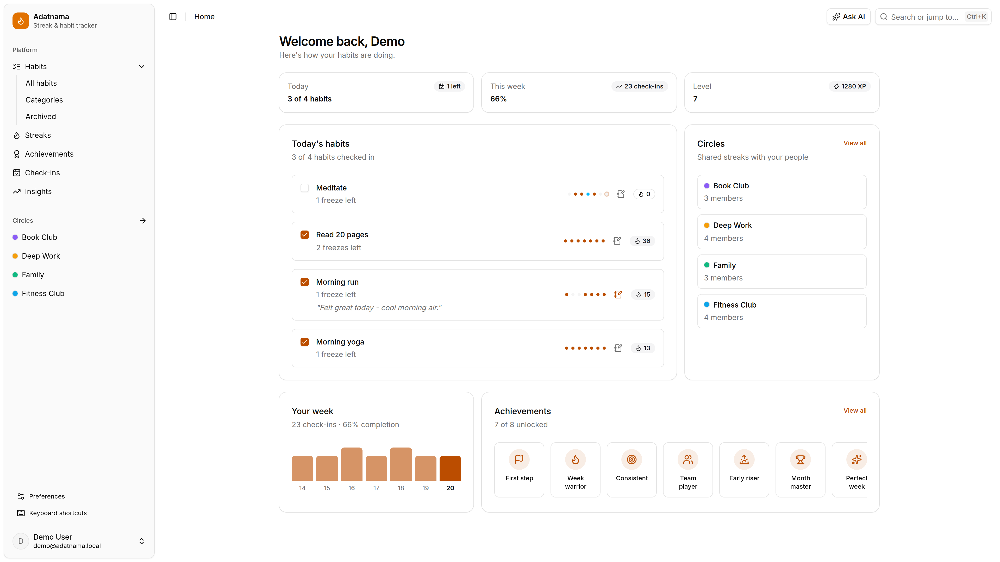

# Adatnama

A local-first streak & habit tracker built on the TanStack ecosystem and deployed to Cloudflare Workers. Check in daily, keep your streaks alive, and share habits with friends — online or offline.

<picture>
  <source media="(prefers-color-scheme: dark)" srcset="public/cover-dark.png">
  
</picture>

## Features

- **One-click check-ins** — optimistic, offline-first writes; everything keeps working without a connection and syncs back when you're online.
- **Streaks & freezes** — current and longest streaks computed client-side from raw check-ins, with streak freezes that absorb a missed day before the streak breaks.
- **Habits your way** — per-habit schedules, categories, notes on check-ins, and archiving. Habit detail shows a full year of history.
- **Check-ins calendar** — every day, every habit, in one view.
- **Insights** — completion trends and weekly rates charted from your own data.
- **Achievements & levels** — unlock badges and earn XP as streaks and circles grow.
- **Circles** — share habits with friends via a join code, watch each other's live streaks, and duplicate any shared habit into your own list.
- **Push reminders** — Web Push notifications at each habit's reminder time, in your timezone, driven by Durable Object alarms.
- **AI assistant** — ask questions about your habits (press `A`).
- **Keyboard-first** — command menu on `Ctrl+K`, hotkeys throughout, theme toggle on `T`.
- **Installable PWA** — local SQLite persistence in the browser, dark/light/system themes.

## Tech stack

Built almost entirely on [TanStack](https://tanstack.com):

| Package                                 | Used for                                                                                        |
| --------------------------------------- | ----------------------------------------------------------------------------------------------- |
| [Start](https://tanstack.com/start)     | Full-stack React framework, SSR, server functions                                               |
| [Router](https://tanstack.com/router)   | File-based routing with typed navigation                                                        |
| [Query](https://tanstack.com/query)     | Server-state fetching and caching                                                               |
| [DB](https://tanstack.com/db)           | Local-first collections with live queries, offline transactions, and browser SQLite persistence |
| [Table](https://tanstack.com/table)     | Data tables                                                                                     |
| [Form](https://tanstack.com/form)       | Type-safe forms                                                                                 |
| [AI](https://tanstack.com/ai)           | The habit-aware AI assistant                                                                    |
| [Charts](https://tanstack.com/charts)   | Insights visualizations                                                                         |
| [Hotkeys](https://tanstack.com/hotkeys) | Keyboard shortcuts                                                                              |
| [Virtual](https://tanstack.com/virtual) | Virtualized lists                                                                               |

Plus: **React 19**, **Better Auth** (username/password + Google), **Kysely** on **Cloudflare D1**, **Cloudflare Workers / R2 / Durable Objects**, **Tailwind CSS 4** + **shadcn/ui**, **Zod**, and **Vite**.

## Getting started

```bash
pnpm install
cp .dev.vars.example .dev.vars   # fill in BETTER_AUTH_SECRET (openssl rand -base64 32)
pnpm db:migrate                  # apply migrations to the local D1
pnpm db:seed                     # optional demo data (sign in as demo / demo1234)
pnpm dev                         # http://localhost:3000
```

After changing `wrangler.jsonc` or `.dev.vars`, rerun `pnpm cf-typegen` to refresh `worker-configuration.d.ts`.

## Scripts

```bash
pnpm lint / format / check       # eslint + prettier
pnpm db:migration:create <name>  # create the next numbered SQL migration
pnpm db:migrate:remote           # apply migrations to the real D1
pnpm demo:record                 # record a feature-tour video with Puppeteer
```

## Deploy

Deploys to Cloudflare Workers via the Cloudflare Vite plugin and `wrangler.jsonc`:

```bash
pnpm db:migrate:remote
wrangler secret put BETTER_AUTH_SECRET
pnpm run deploy                  # build + wrangler deploy
```

Public vars (`BETTER_AUTH_URL`, `R2_PUBLIC_URL`, …) live under `vars` in `wrangler.jsonc`; D1, R2, and Durable Object bindings are configured there too.
